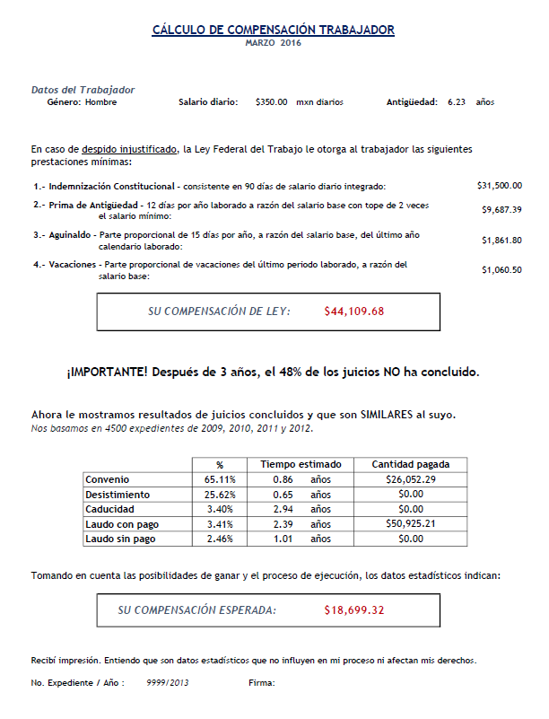

```{r setup, include=FALSE}
knitr::opts_chunk$set(echo = TRUE)
```

Mexican labour courts face a large and growing backlog of cases. The backlog is made worse by case settlement rates that are low by international standards. Our previous work suggests that one cause of the low settlement rates is that parties are overconfident of their chances of success. We tested this hypothesis through an experimental intervention in the Mexico City Labour Court (MCLC). In a pilot project in the MCLC, we provided objective statistical information to parties in randomly selected cases to see if this information changed the likelihood of parties reach a settlement. An initial 12-week pilot in one of the MCLC’s 20 subcourts showed that providing objective information nearly doubled settlement rates on the same day. Given these initial results, we then increased the scale of the project for a second intervention to confirm the result.

These experiments required that we generate information to share with workers. We produced a set of predictive models using data from cases filed in 2011.We refer to the resulting product as a “calculator.” The predicted outcomes are based on information in case filings, including the wage and tenure of the worker, and other variables described in more detail below. Each of the MCLC’s 20 subcourts handles cases originating from disputes in a given set of industries. Thus, the predictive information needed to be based on information from the relevant subcourts.

For the initial experiment, we used data from cases filed in 2011 in subcourt 7, where the pilot took place; for the second experiment, we revised the calculator based on information from the five subcourts where the expanded experiment took place. In both cases, we used data on whether the case was completed or still ongoing, and the amount of any settlement for the subset of lawsuits that were settled. The calculator produces predictions on the probability of the case finishing with a certain outcome and the expected payoff of that outcome (this includes the amount of money awarded to the plaintiff and the overall duration of the lawsuit).


# First Pilot 
## Data
The data for the calculator developed for the pilot came from a sample of 1000 concluded case files from a single subcourt (subcourt 7). Defendants in subcourt 7 consist mostly of firms in XXX industries, so we were careful in correctly labeling casefiles containing at least one outsourcing firm within the list of defendants.

We coded data directly from casefiles, and then randomly inspected 20% of the data entries by comparing the manually coded databases against the actual casefiles to ensure that the initial coding was accurate. Our data cleaning process was fairly standard. We then examined the data for outliers, recoding as necessary We excluded a small number of cases for which key information was missing.

## Models
### Our questions

We aimed to provide three pieces of information:

1. How likely is settlement, abandonment by the plaintiff, expiry, or a judicial decision in favour of either party?

2. Given a particular outcome, what was the expected duration for the entire process?

3. Given a particular outcome, what was the expected compensation at the end of the process?

These questions were addressed as one classification problem -for the first case- and two regression/prediction problems -for the second and third cases.

### Training and Evaluation

For all three questions, the sample was divided in 70-30 training and test sets. We simplified categorical variables in order to remove sparse groups in our covariates.

#### Probability of outcomes

We aggregated the ending possibilites for casefiles into 5 different outcomes:

- Settlement

- Expiry

- Court Ruling with a positive compensation

- Court Ruling with no compensation

- Drop

For our classification problem, the dependent variable -a categorical variable depicting the case ending- was recoded into 5 dummy variables. The following models were then tested for classification of each binary outcome:

A. Logistic Regression

B. Probit 

C. Random Forest (100 trees)

D. Single-hidden-layer Neural Network (20 nodes in the hidden layer and 10% weight decay)

E. Gradient Boosting

Due to our sample size, all hyperparameters were chosen specifically to avoid overfitting. Models were chosen for each outcome based on classification accuracy for the test set. 

**XXX (1) **
** Propuestas:** 
**A. Poner unos histogramas de accuracy rate entre modelos **
**B. Poner unas tablitas de la métrica en cuestión (i.e. accuracy rate y MAPD) **

#### Prediction models

We set out to predict expected lawsuit duration for each given outcome. Predicting expected compensation was only required for Settlements and Court Rulings, since the other outcomes imply zero expected payment. We trained a set of 4 different models for each prediction problem, considering both regular and logarithmic models. The logarithmic models proved extremely useful to tackle the skewness of our dependent variable distributions. Our model list included the following:

A. OLS regression

B. GLM Boosting

C. Random Forest (100 trees) 

D. Ridge Regression

The 7 models to be used in the calculator were chosen based on the *MAPD (Mean Absolute Percentage Deviation).* This evaluation measure was chosen because we had no zero values in our dependent variables and were inclined to giving rather conservative predictions to parties.

**XXX (2) **
** Propuestas:** 
**A. Poner unas scatter plots de y vs. ygorro como las que hice para el paper. **
**B. Poner unas tablitas de la métrica en cuestión (i.e. accuracy rate y MAPD)**

## Information

Our prediction sheets were generated for each subject in real time, and contained the following information:




# Scale-Up
## Data 

This scale-up was running in 5 different subcourts -including subcourt 7- so we coded an additional 4000 casefiles from the new subcourts, from the same time period. We used all 5000 observations as our working data. The coding and supervision process was entirely analogous to the ones implemented in our first pilot. 

## Models 

The operation of the first pilot gave us two key insights for building our second calculator: we wanted to display less information for subjects to process, and we were to stress the relationship between the subject and the information we were sharing, so we decided to limit our predictions and include some personalized information on the worker, intended to shed some light on the drivers of our predictions. 

### Our Questions

We narrowed our original set of questions to answering:

1. Given a case ending in a court ruling, how likely is to recover a positive compensation? 

2. What would be that expected compensation?

3. Given a case ending in settlement, what would be the expected compensation?

### Training and Evaluation
#### Probability of winning

Our classification problem became slightly different. In order to assess the unbalancedness of our court rulings sample -only 24% of court rulings ever recover something- we used a Synthetic Minority Over-Sampling Technique -see [(Chawla et.al., 2002)](http://jair.org/media/953/live-953-2037-jair.pdf) for more detail- and did a 80-20 train vs. test split on our data.

After some preliminary tests, we decided to focus on Random Forests. For this Scale-Up, we perfomed grid search in order to find the best hyperparameter setting. We compared 7 different models with the number of trees ranging between 900 and 1500.

Our final model resulted in a Random Forest of 1200 CARTs, which yielded an 86% accuracy rate on test classification.  

#### Expected compensations

In order for our results to be easily interpreted and taking advantage of our bigger sample size, we decided to use more standard regression tools. We compared between several specifications of OLS and Kernel regressions, using a Gaussian kernel for the latter. Both models were trained for the original variables and taking logarithms of all numeric variables.

The final models were chosen based on the Mean Squared Error, and certain aspects of the out-of-sample error distributions. For this second criterion we estimated this distribution by retraining the model 1000 times on a 70-30 train-test split and computing prediction errors. 

**XXX (3)** 
** Aquí tenemos las grafiquitas de las distribuciones de errores con las que evaluamos los modelos (les anexo el doc, por si no lo recuerdan). Puedo poner esas, aunque no me encantan, puedo poner una tablita con los MSE, puedo hacer otras... Como me digan** 

## Information 

The information sheets were generated before time for this operation, and handed out to subjects in treatment days. The sheets had the following layout:

**XXX Este me falta**


